**[APK Download](/app-debug.apk)**

# CustomerView-Kotlin

This project is implemented by kotlin based on AndroidX and shows you some interesting customer views. 

It includes:

1. [PorterDuffxfermode](./app/src/main/java/com/jay/kotlin/customerview/geometric/PorterDuffXferMode.kt)
2. [Geometric View](./app/src/main/java/com/jay/kotlin/customerview/geometric/Geometric.kt)
3. [Bezier Curve](./app/src/main/java/com/jay/kotlin/customerview/geometric/BezierCurve.kt)
4. [Bezier Curve Circle View](./app/src/main/java/com/jay/kotlin/customerview/customer/BezierCurveCircleView.kt)
5. [Bezier Curve Eye View](./app/src/main/java/com/jay/kotlin/customerview/customer/BezierCurveEyeView.kt)
6. [Bezier Wave View](./app/src/main/java/com/jay/kotlin/customerview/customer/BezierWaveView.kt)
7. [Circle Percent View](./app/src/main/java/com/jay/kotlin/customerview/customer/CirclePercentView.kt)
8. [Compass 3D View](./app/src/main/java/com/jay/kotlin/customerview/customer/Compass3DView.kt)
9. [Downloading View](./app/src/main/java/com/jay/kotlin/customerview/customer/DownloadingView.kt)
10. [Error View](./app/src/main/java/com/jay/kotlin/customerview/customer/ErrorView.kt)
11. [Hexagon View](./app/src/main/java/com/jay/kotlin/customerview/customer/HexagonView.kt)
12. [Line Chart View](./app/src/main/java/com/jay/kotlin/customerview/customer/LineChartView.kt)
13. [Panel View](./app/src/main/java/com/jay/kotlin/customerview/customer/PanelView.kt)
14. [Popup View](./app/src/main/java/com/jay/kotlin/customerview/customer/PopupView.kt)
15. [Spring View](./app/src/main/java/com/jay/kotlin/customerview/customer/SpringView.kt)
16. [Wave View](./app/src/main/java/com/jay/kotlin/customerview/customer/WaveView.kt)
17. [Arc Menu Layout](./app/src/main/java/com/jay/kotlin/customerview/layout/ArcMenuLayout.kt)
18. [Coupon Game Layout](./app/src/main/java/com/jay/kotlin/customerview/layout/CouponGameLayout.kt)
19. [Drawer Menu Layout](./app/src/main/java/com/jay/kotlin/customerview/layout/DrawerMenuLayout.kt)

## More Details

1. [PorterDuffxfermode](./app/src/main/java/com/jay/kotlin/customerview/geometric/PorterDuffXferMode.kt)

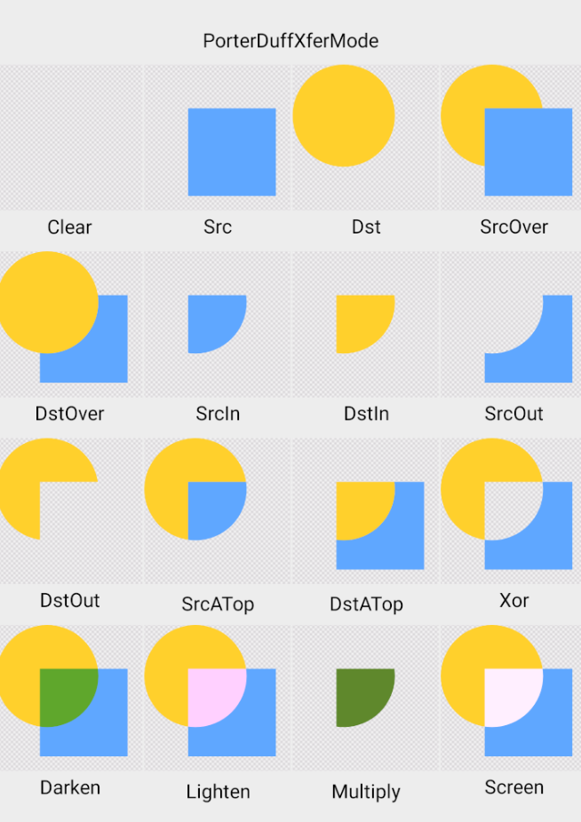

---------

2. [Geometric View](./app/src/main/java/com/jay/kotlin/customerview/geometric/Geometric.kt)

> **Highlights:**
>
> - Line
>
> - Trangle
>
> - Circle
>
> - Arc
>
> - Text

-----

3. [Bezier Curve](./app/src/main/java/com/jay/kotlin/customerview/geometric/BezierCurve.kt)

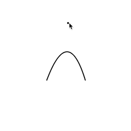

> **Highlights:**
>
> - Three points Bezier curve
> - Touch event

-----

4. [Bezier Curve Circle View](./app/src/main/java/com/jay/kotlin/customerview/customer/BezierCurveCircleView.kt)

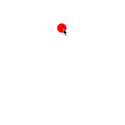

> **Highlights:**
>
> - Bezier curve
>
> - Circle
>
> - Touch event

-----

5. [Bezier Curve Eye View](./app/src/main/java/com/jay/kotlin/customerview/customer/BezierCurveEyeView.kt)

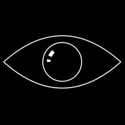

> **Highlights:**
>
> - Bezier curve
>
> - Circle
>
> - Arc
>
> - Alpha

-----

6. [Bezier Wave View](./app/src/main/java/com/jay/kotlin/customerview/customer/BezierWaveView.kt)

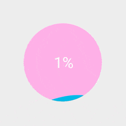

> **Highlights:**
>
> - Bezier curve
>
> - Circle
>
> - Text

-----

7. [Circle Percent View](./app/src/main/java/com/jay/kotlin/customerview/customer/CirclePercentView.kt)

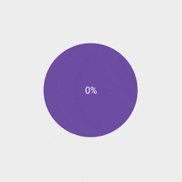

> **Highlights:**
>
> - Arc
>
> - Circle
>
> - Text
>
> - Interpolator

-----

8. [Compass 3D View](./app/src/main/java/com/jay/kotlin/customerview/customer/Compass3DView.kt)

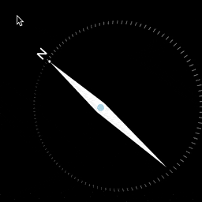

> **Highlights:**
>
> - Touch event
>
> - Circle
>
> - Text

-----

9. [Downloading View](./app/src/main/java/com/jay/kotlin/customerview/customer/DownloadingView.kt)

> **Highlights:**
>
> - Arc
>
> - Circle
>
> - Interpolator
>
> - Path

-----

10. [Error View](./app/src/main/java/com/jay/kotlin/customerview/customer/ErrorView.kt)

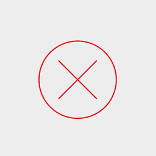

> **Highlights:**
>
> - Path
>
> - Circle
>
> - Translate

-----

11. [Hexagon View](./app/src/main/java/com/jay/kotlin/customerview/customer/HexagonView.kt)

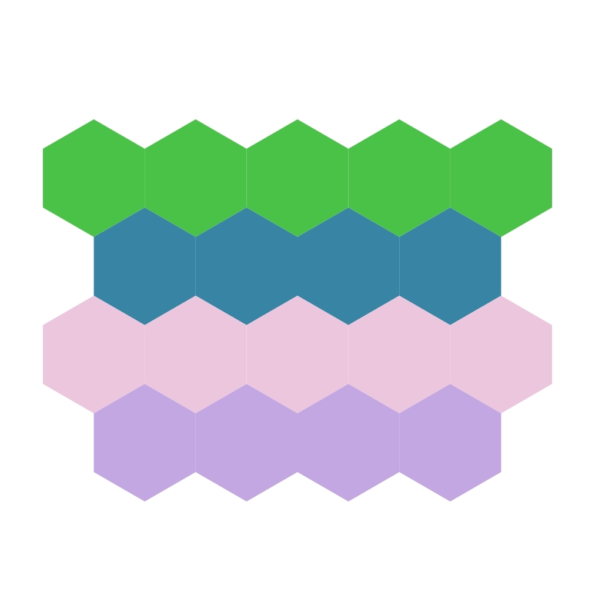

> **Highlights:**
>
> - Path
>
> - Coordinates

-----

12. [Line Chart View](./app/src/main/java/com/jay/kotlin/customerview/customer/LineChartView.kt)

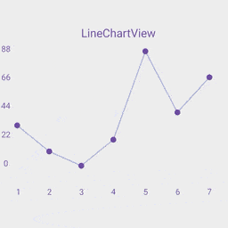

> **Highlights:**
>
> - Path
>
> - Coordinates
>
> - Text

-----

13. [Panel View](./app/src/main/java/com/jay/kotlin/customerview/customer/PanelView.kt)

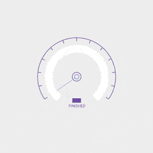

> **Highlights:**
>
> - Arc
>
> - Circle
>
> - Text

-----

14. [Popup View](./app/src/main/java/com/jay/kotlin/customerview/customer/PopupView.kt)

> **Highlights:**
>
> - Path
>
> - Rect

-----

15. [Spring View](./app/src/main/java/com/jay/kotlin/customerview/customer/SpringView.kt)

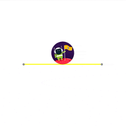

> **Highlights:**
>
> - Path
>
> - Touch event
>
> - Interpolator

-----

16. [Wave View](./app/src/main/java/com/jay/kotlin/customerview/customer/WaveView.kt)

> **Highlights:**
>
> - Arc
>
> - Rect

-----

17. [Arc Menu Layout](./app/src/main/java/com/jay/kotlin/customerview/layout/ArcMenuLayout.kt)

> **Highlights:**
>
> - Layout
>
> - Rotate
>
> - Translate

-----

18. [Coupon Game Layout](./app/src/main/java/com/jay/kotlin/customerview/layout/CouponGameLayout.kt)

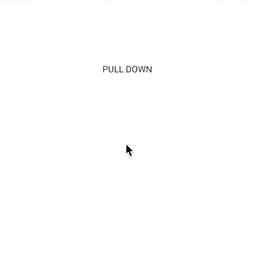

> **Highlights:**
>
> - Layout
>
> - Touch event
>
> - Text

-----

19. [Drawer Menu Layout](./app/src/main/java/com/jay/kotlin/customerview/layout/DrawerMenuLayout.kt)

> **Highlights:**
>
> - Layout
>
> - Translate

## Reference

[Android customer view](https://www.kancloud.cn/digest/wingscustomview/129802)

