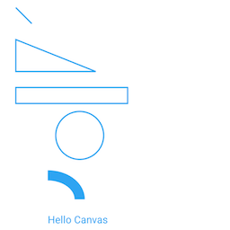

**[APK Download](/app-debug.apk)**

# CustomerView-Kotlin

This project is implemented by kotlin based on AndroidX and shows you some interesting customer views. 

## Content :

1. [PorterDuffxfermode](#1-porterduffxfermode)
2. [Geometric View](#2-geometric-view)
3. [Bezier Curve](#3-bezier-curve)
4. [Bezier Curve Circle View](#4-bezier-curve-circle-view)
5. [Bezier Curve Eye View](#5-bezier-curve-eye-view)
6. [Bezier Wave View](#6-bezier-wave-view)
7. [Circle Percent View](#7-circle-percent-view)
8. [Compass 3D View](#8-compass-3d-view)
9. [Downloading View](#9-downloading-view)
10. [Error View](#10-error-view)
11. [Hexagon View](#11-hexagon-view)
12. [Line Chart View](#12-line-chart-view)
13. [Panel View](#13-panel-view)
14. [Popup View](#14-popup-view)
15. [Spring View](#15-spring-view)
16. [Wave View](#16-wave-view)
17. [Arc Menu Layout](#17-arc-menu-layout)
18. [Coupon Game Layout](#18-coupon-game-layout)
19. [Drawer Menu Layout](#19-drawer-menu-layout)

## More Details

#### 1. [PorterDuffxfermode](./app/src/main/java/com/jay/kotlin/customerview/geometric/PorterDuffXferMode.kt)

---

#### 2. [Geometric View](./app/src/main/java/com/jay/kotlin/customerview/geometric/Geometric.kt)

> **Highlights:**
>
> - Line
>
> - Trangle
>
> - Circle
>
> - Arc
>
> - Text

-----

#### 3. [Bezier Curve](./app/src/main/java/com/jay/kotlin/customerview/geometric/BezierCurve.kt)

> **Highlights:**
>
> - Three points Bezier curve
> - Touch event

-----

#### 4. [Bezier Curve Circle View](./app/src/main/java/com/jay/kotlin/customerview/customer/BezierCurveCircleView.kt)

> **Highlights:**
>
> - Bezier curve
>
> - Circle
>
> - Touch event

-----

#### 5. [Bezier Curve Eye View](./app/src/main/java/com/jay/kotlin/customerview/customer/BezierCurveEyeView.kt)

> **Highlights:**
>
> - Bezier curve
>
> - Circle
>
> - Arc
>
> - Alpha

-----

#### 6. [Bezier Wave View](./app/src/main/java/com/jay/kotlin/customerview/customer/BezierWaveView.kt)

> **Highlights:**
>
> - Bezier curve
>
> - Circle
>
> - Text

-----

#### 7. [Circle Percent View](./app/src/main/java/com/jay/kotlin/customerview/customer/CirclePercentView.kt)

> **Highlights:**
>
> - Arc
>
> - Circle
>
> - Text
>
> - Interpolator

-----

#### 8. [Compass 3D View](./app/src/main/java/com/jay/kotlin/customerview/customer/Compass3DView.kt)

> **Highlights:**
>
> - Touch event
>
> - Circle
>
> - Text

-----

#### 9. [Downloading View](./app/src/main/java/com/jay/kotlin/customerview/customer/DownloadingView.kt)

> **Highlights:**
>
> - Arc
>
> - Circle
>
> - Interpolator
>
> - Path

-----

#### 10. [Error View](./app/src/main/java/com/jay/kotlin/customerview/customer/ErrorView.kt)

> **Highlights:**
>
> - Path
>
> - Circle
>
> - Translate

-----

#### 11. [Hexagon View](./app/src/main/java/com/jay/kotlin/customerview/customer/HexagonView.kt)

> **Highlights:**
>
> - Path
>
> - Coordinates

-----

#### 12. [Line Chart View](./app/src/main/java/com/jay/kotlin/customerview/customer/LineChartView.kt)

> **Highlights:**
>
> - Path
>
> - Coordinates
>
> - Text

-----

#### 13. [Panel View](./app/src/main/java/com/jay/kotlin/customerview/customer/PanelView.kt)

> **Highlights:**
>
> - Arc
>
> - Circle
>
> - Text

-----

#### 14. [Popup View](./app/src/main/java/com/jay/kotlin/customerview/customer/PopupView.kt)

> **Highlights:**
>
> - Path
>
> - Rect

-----

#### 15. [Spring View](./app/src/main/java/com/jay/kotlin/customerview/customer/SpringView.kt)

> **Highlights:**
>
> - Path
>
> - Touch event
>
> - Interpolator

-----

#### 16. [Wave View](./app/src/main/java/com/jay/kotlin/customerview/customer/WaveView.kt)

> **Highlights:**
>
> - Arc
>
> - Rect

-----

#### 17. [Arc Menu Layout](./app/src/main/java/com/jay/kotlin/customerview/layout/ArcMenuLayout.kt)

> **Highlights:**
>
> - Layout
>
> - Rotate
>
> - Translate

-----

#### 18. [Coupon Game Layout](./app/src/main/java/com/jay/kotlin/customerview/layout/CouponGameLayout.kt)

> **Highlights:**
>
> - Layout
>
> - Touch event
>
> - Text

-----

#### 19. [Drawer Menu Layout](./app/src/main/java/com/jay/kotlin/customerview/layout/DrawerMenuLayout.kt)

> **Highlights:**
>
> - Layout
>
> - Translate

## Reference

[Android customer view](https://www.kancloud.cn/digest/wingscustomview/129802)

